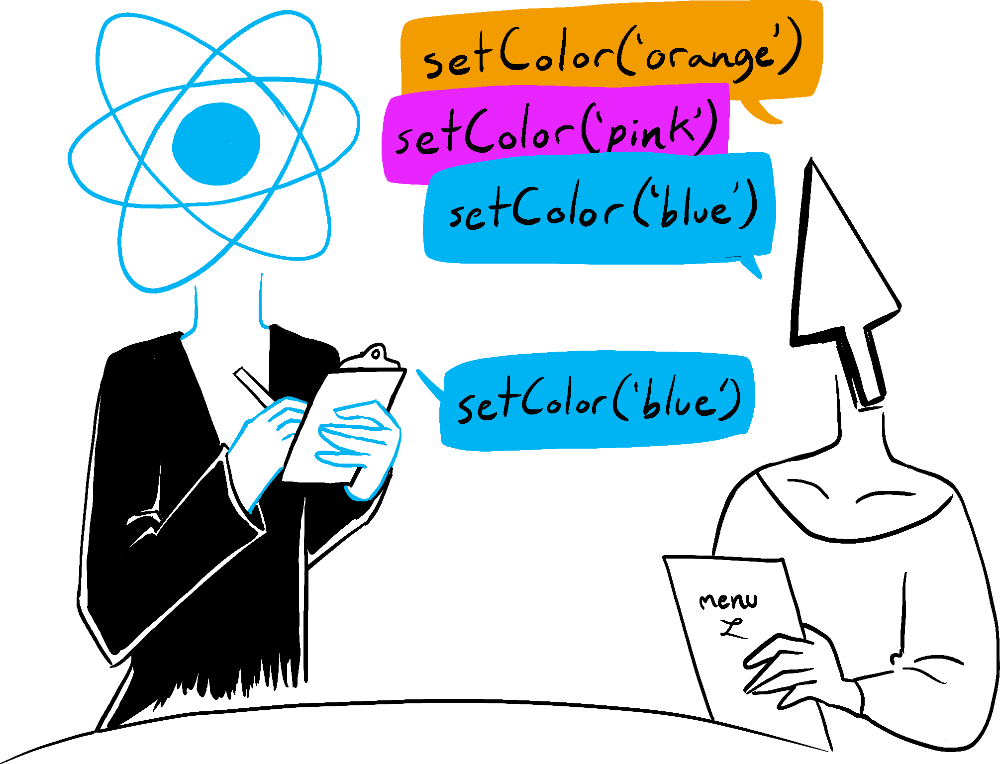

# 2023 11.19 React Basics

By Sudo


<div class="abs-br m-6 flex gap-2">
  <button @click="$slidev.nav.openInEditor()" title="Open in Editor" class="text-xl slidev-icon-btn opacity-50 !border-none !hover:text-white">
    <carbon:edit />
  </button>
  <a href="https://github.com/slidevjs/slidev" target="_blank" alt="GitHub"
    class="text-xl slidev-icon-btn opacity-50 !border-none !hover:text-white">
    <carbon-logo-github />
  </a>
</div>


---
transition: fade-out
---

# Review 


---

## HTML
<div align="center">
  
</div>
<br>

```js
let title = document.getElementById("articleTitle");
let loginBtn = document.getElementsByName("login")[0];
let callouts = document.getElementsByClassName("callout"); // *
```
<!--
You can have `style` tag in markdown to override the style for the current page.
Learn more: https://sli.dev/guide/syntax#embedded-styles
-->
---

## Javascript 

### Functions
```javascript
const fToC = function(temp) {
  return (temp - 32) * 5/9;
}
```
Arrow Function!
```javascript
const fToC = (temp) => {
  return (temp - 32) * 5/9;
}
```
<!--
Here is another comment.
-->
---

## JS Objects <=> JSON
```javascript
let teachingAssistant = {
   firstName: "Alice",
   lastName: "Smith",
   age: 24
};
```
```json
{
   "firstName": "Alice",
   "lastName": "Smith",
   "age": 24
}
```
- JSON.parse() JSON String => JS Object
- JSON.stringify() JS Object => JSON String

---

# API 

**Definition:** An application programming interface (API) is a set of definitions and protocols for communication through the serialization and de-serialization of objects.

Requests can be `synchronous` or `asynchronous`. 


---

### Callback Functions

`then` and `catch` take a *callback function* as an argument.

**Definition:** A *callback function* (sometimes called a *function reference*) is passed into another function as an argument, which is then invoked inside the outer function to complete a routine or action.
```js
const name = prompt('Please enter your name.');
function processUserInput(callback) {
  alert("Incoming message!")
  callback(name);
}
function greeting1(name) {
  alert('Hello ' + name);
}
const greeting2 = (name) => {
  alert('Whats up ' + name);
}
processUserInput(greeting1);
processUserInput(greeting2);
processUserInput((name) => alert("Welcome " + name));
```
---

# Declarative vs Imperative Programming
The following is imperative...

`for (let obj of arr) { /* stmts */ }`

###

The following is declarative...

`arr.forEach((obj) => { /* stmts */ })`


Declarative array functions include `forEach`, `map`, `slice`, `concat`, `filter`, `some`, `every`, and `reduce`.

###

---

# Spread Operator 
Shallow copy!
```js
const defs = {
  erf: "a plot of land",
  popple: "turbulent seas"
}

const newDefs = {
  ...defs,
  futz: "waste of time"
}
```
Shallow Copy? Deep Copy? Reference Copy?

---
layout: default
---

# Table of contents

```html
<Toc minDepth="1" maxDepth="1"></Toc>
```

<Toc maxDepth="1"></Toc>

---
transition: slide-up
---

# Why react?

- `innerHTML` is bad
- Efficient DOM updating
- Declarative programming

---
layout: image-right

---

## InnerHTML is bad

```js
<html>
  <head></head>
  <body>
    <h1>Badger Book</h1>
    <div id="student"></div>
  </body>
</html>
```
```js
const name = "<image src='abc.png' onerror='alert(document.cookie)'/>";
document.getElementById("student").innerHTML = '<h2>' + name + '</h2>'
```


---

## Efficient DOM Updating
Virtual DOM


--- 

## Virtual DOM
<div>


</div>


---
---


# Getting started in React

```bash
npx create-react-app my-app
cd my-app
npm start
```

- Every "thing" is a component.

- Every component is a function, inheriting `props` and maintaining an internal `state`.

A component will re-render when...


  1. its `props` changes
  2. its `state` changes
  3. its parent re-renders


---


# React Components

```js
function App() {
  return (
    <div>
      <Welcome person="Charlie"></Welcome>
      <Welcome person="Jessica"></Welcome>
      <Welcome person="Tonya"></Welcome>
    </div>
  );
}
function Welcome(props) {
  return <h1>Welcome, {props.person}</h1>;
}
```

- JSX
- Props passed by its parent


<!-- vue script setup scripts can be directly used in markdown, and will only affects current page -->

---

# Internal State (UseState)

```js
function Welcome() {
  const [name, setName] = useState("Alba");
  return <h1>Welcome, {name}</h1>;
}
```
Using a callback function in `setState`
```js
setName(oldName => oldName.substring(0, oldName.length - 1));
```
Using together with spread operator
```js
setNames((oldNames) => [...oldNames, "Jim"]);
```
Remember setState is asynchronous!

---

# Overwriting vs Updating State

```js
export default function Counter() {
  const [number, setNumber] = useState(0);
  return <div>
    <h1>{number}</h1>
    <button onClick={() => {
      setNumber(number + 1);
      setNumber(number + 1);
      setNumber(number + 1);
    }}>+3</button>
  </div>
}
```
```js
export default function Counter() {
  const [number, setNumber] = useState(0);
  return <div>
    <h1>{number}</h1>
    <button onClick={() => {
      setNumber(n => n + 1);
      setNumber(n => n + 1);
      setNumber(n => n + 1);
    }}>+3</button>
  </div>
}
```
---



---
# Map arrays of data
---


---

# React key prop
The `key` prop is used by React to speed up rendering. 

 - Always use a *unique* key for the *parent-most* element rendered in a list.
 - This key needs to be *unique among siblings*.
 - This key should *usually* not be the index of the item (e.g. what if the order changes?)

[Documentations](https://sli.dev) · [GitHub](https://github.com/slidevjs/slidev) · [Showcases](https://sli.dev/showcases.html)

---
# UseEffect

---

# React Router

---

# React Devtools
